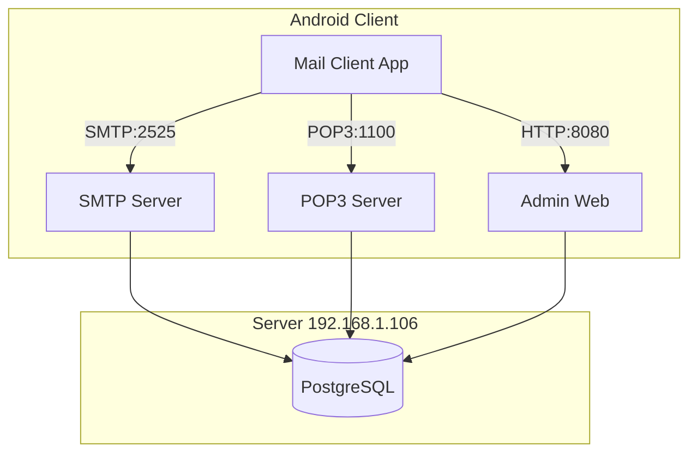
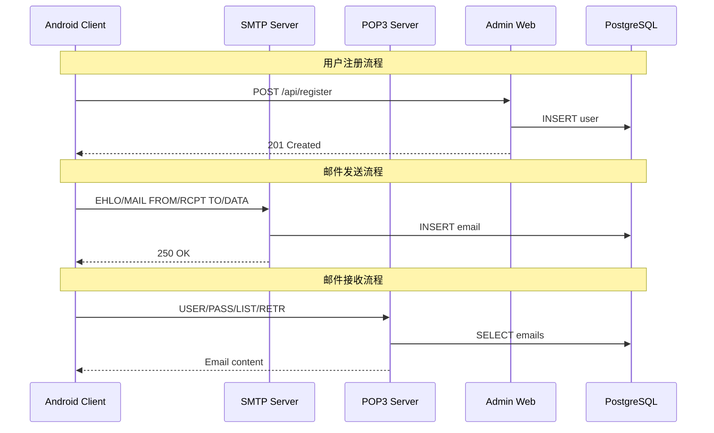

# Design Document: Mail System Enhancement

## Overview

本设计文档描述邮件收发系统的完善方案，实现一个实际可用的邮件系统，包含三个核心模块：

1. **Admin Web** - 基于 Spring Boot 4.0 的服务器管理后台
2. **SMTP/POP3 Server** - 基于 Java 25 虚拟线程的邮件传输服务器
3. **Android Client** - 基于 Kotlin + Jetpack Compose 的移动端客户端

服务器 IP: 192.168.1.106，SMTP 端口: 2525，POP3 端口: 1100

## Architecture



### 系统交互流程



## Components and Interfaces

### 1. Android Client Components

#### 1.1 Network Layer

```kotlin
// API Service for Admin Web communication
interface AdminApiService {
    suspend fun register(request: RegisterRequest): Result<RegisterResponse>
    suspend fun changePassword(request: PasswordChangeRequest): Result<Unit>
    suspend fun getDomains(): Result<List<Domain>>
}

// Data classes
data class RegisterRequest(
    val username: String,
    val domain: String,
    val password: String
)

data class RegisterResponse(
    val id: String,
    val email: String,
    val message: String
)

data class PasswordChangeRequest(
    val email: String,
    val currentPassword: String,
    val newPassword: String
)
```

#### 1.2 Repository Layer

```kotlin
class EmailRepository(
    private val emailDao: EmailDao,
    private val accountDao: AccountDao,
    private val adminApi: AdminApiService
) {
    // 用户注册
    suspend fun register(username: String, domain: String, password: String): Result<Unit>
    
    // 密码修改
    suspend fun changePassword(currentPassword: String, newPassword: String): Result<Unit>
    
    // 邮件操作 (已实现)
    suspend fun syncEmails(account: EmailAccount): Result<Int>
    suspend fun sendEmail(...): Result<Unit>
    suspend fun deleteEmailFromServer(email: Email): Result<Unit>
}
```

### 2. Admin Web Components

#### 2.1 REST API Controller

```java
@RestController
@RequestMapping("/api")
public class ApiController {
    
    @PostMapping("/register")
    public ResponseEntity<RegisterResponse> register(@RequestBody RegisterRequest request);
    
    @PostMapping("/password/change")
    public ResponseEntity<Void> changePassword(@RequestBody PasswordChangeRequest request);
    
    @GetMapping("/domains")
    public ResponseEntity<List<DomainDto>> getDomains();
}
```

#### 2.2 Bulk Email Service

```java
@Service
public class BulkEmailService {
    
    public void queueBulkEmail(String subject, String body, List<String> recipients);
    
    public BulkEmailStats getDeliveryStats(UUID batchId);
}
```

### 3. SMTP/POP3 Server Components

现有实现已完整，主要增强：

- 用户认证时检查账户启用状态
- 域名验证时检查域名启用状态
- 邮件大小限制检查

## Data Models

### 1. Database Schema (PostgreSQL)

```sql
-- 用户表 (已存在)
CREATE TABLE users (
    id UUID PRIMARY KEY DEFAULT gen_random_uuid(),
    username VARCHAR(64) NOT NULL,
    domain VARCHAR(255) NOT NULL,
    email VARCHAR(320) NOT NULL UNIQUE,
    password_hash VARCHAR(255) NOT NULL,
    quota_bytes BIGINT DEFAULT 1073741824,
    used_bytes BIGINT DEFAULT 0,
    is_enabled BOOLEAN DEFAULT true,
    created_at TIMESTAMPTZ DEFAULT NOW(),
    updated_at TIMESTAMPTZ DEFAULT NOW(),
    last_login_at TIMESTAMPTZ
);

-- 邮件表 (已存在)
CREATE TABLE emails (
    id UUID PRIMARY KEY DEFAULT gen_random_uuid(),
    sender VARCHAR(320) NOT NULL,
    recipients TEXT[] NOT NULL,
    subject VARCHAR(998),
    body TEXT,
    raw_content TEXT,
    size BIGINT,
    received_at TIMESTAMPTZ DEFAULT NOW(),
    owner VARCHAR(320),
    is_read BOOLEAN DEFAULT false,
    is_deleted BOOLEAN DEFAULT false
);

-- 域名表 (已存在)
CREATE TABLE mail_domains (
    id UUID PRIMARY KEY DEFAULT gen_random_uuid(),
    domain VARCHAR(255) NOT NULL UNIQUE,
    is_enabled BOOLEAN DEFAULT true,
    created_at TIMESTAMPTZ DEFAULT NOW()
);

-- 服务器配置表 (新增)
CREATE TABLE server_config (
    key VARCHAR(64) PRIMARY KEY,
    value VARCHAR(255) NOT NULL,
    updated_at TIMESTAMPTZ DEFAULT NOW()
);

-- 群发邮件批次表 (新增)
CREATE TABLE bulk_email_batches (
    id UUID PRIMARY KEY DEFAULT gen_random_uuid(),
    subject VARCHAR(998) NOT NULL,
    body TEXT NOT NULL,
    total_count INT NOT NULL,
    success_count INT DEFAULT 0,
    failure_count INT DEFAULT 0,
    status VARCHAR(20) DEFAULT 'PENDING',
    created_at TIMESTAMPTZ DEFAULT NOW(),
    completed_at TIMESTAMPTZ
);
```

### 2. Android Local Database (Room)

```kotlin
// 已存在，无需修改
@Entity(tableName = "emails")
data class Email(...)

@Entity(tableName = "accounts")
data class EmailAccount(...)
```

## Correctness Properties

*A property is a characteristic or behavior that should hold true across all valid executions of a system-essentially, a formal statement about what the system should do. Properties serve as the bridge between human-readable specifications and machine-verifiable correctness guarantees.*

Based on the prework analysis, the following correctness properties have been identified:

### Property 1: Registration creates valid user
*For any* valid registration request with username, domain, and password (≥6 chars), submitting registration SHALL result in a user record being created in the database with the correct email format (username@domain) and default quota settings.
**Validates: Requirements 1.1, 1.5**

### Property 2: Email validation rejects invalid formats
*For any* string that does not match the email format pattern (missing @, invalid domain, etc.), the registration system SHALL reject the input and return a validation error.
**Validates: Requirements 1.3**

### Property 3: Password length validation
*For any* password string with length less than 6 characters, the registration system SHALL reject the input and return a password requirement error.
**Validates: Requirements 1.4**

### Property 4: Authentication with valid credentials succeeds
*For any* enabled user account with valid credentials, authentication against POP3_Server SHALL succeed and return a positive response.
**Validates: Requirements 2.1, 2.4**

### Property 5: Email sending stores in database
*For any* valid email with sender, recipients, subject, and body, sending via SMTP_Server SHALL result in the email being stored in the database with all fields preserved.
**Validates: Requirements 3.1, 3.2**

### Property 6: Multi-recipient delivery
*For any* email sent to N valid recipients (comma-separated), the SMTP_Server SHALL create delivery records for all N recipients.
**Validates: Requirements 3.3**

### Property 7: Retry mechanism with exponential backoff
*For any* failed email send operation, the client SHALL retry up to 3 times with delays following exponential backoff pattern (1s, 2s, 4s).
**Validates: Requirements 3.5**

### Property 8: POP3 LIST returns correct format
*For any* authenticated POP3 session with N emails, the LIST command SHALL return exactly N entries, each with message number and size.
**Validates: Requirements 4.2**

### Property 9: POP3 RETR returns complete email
*For any* valid message number in an authenticated POP3 session, the RETR command SHALL return the complete email content including all headers (From, To, Subject, Date) and body.
**Validates: Requirements 4.3**

### Property 10: Email deletion round-trip
*For any* email marked for deletion via DELE command, after QUIT command, the email SHALL be permanently removed from the database and no longer retrievable.
**Validates: Requirements 5.1, 5.2, 5.3, 5.4**

### Property 11: Admin user management operations
*For any* admin user management operation (create, disable, enable, delete), the operation SHALL correctly update the user record in the database and the user's login capability SHALL reflect the new state.
**Validates: Requirements 6.1, 6.2, 6.3, 6.4**

### Property 12: Password reset updates authentication
*For any* password reset operation, the new password SHALL be usable for authentication immediately after the reset completes.
**Validates: Requirements 6.5, 12.2**

### Property 13: Domain management affects email routing
*For any* disabled domain, the SMTP_Server SHALL reject emails addressed to that domain with an appropriate error response.
**Validates: Requirements 7.2, 7.3**

### Property 14: Configuration storage consistency
*For any* server configuration update (SMTP port, POP3 port, domain), the new value SHALL be persisted and retrievable after the update.
**Validates: Requirements 9.1, 9.2, 9.3**

### Property 15: Queue retry resets state
*For any* failed email in the queue, retrying SHALL reset the retry count to 0 and change status to PENDING.
**Validates: Requirements 11.2**

### Property 16: Email content parsing preserves structure
*For any* email with plain text, HTML, or multipart content, parsing SHALL correctly extract the content type and body, and all headers (From, To, Subject, Date) SHALL be accurately extracted.
**Validates: Requirements 14.1, 14.2, 14.3, 14.4**

### Property 17: Email parsing/serialization round-trip
*For any* valid email, parsing the raw content and then serializing back to RFC 5322 format SHALL produce equivalent output preserving all headers and body content.
**Validates: Requirements 15.1, 15.2, 15.3**

### Property 18: Character encoding preservation
*For any* email containing non-ASCII characters (UTF-8), the parsing and serialization process SHALL preserve all characters correctly.
**Validates: Requirements 15.4**

## Error Handling

### 1. Network Errors

| Error Type | Client Handling | Server Response |
|------------|-----------------|-----------------|
| Connection timeout | Retry with backoff | N/A |
| Connection refused | Show server unavailable | N/A |
| Authentication failed | Show invalid credentials | 535 Authentication failed |
| Invalid recipient | Show delivery failed | 550 User not found |

### 2. Validation Errors

| Error Type | Response Code | Message |
|------------|---------------|---------|
| Invalid email format | 400 | Invalid email format |
| Password too short | 400 | Password must be at least 6 characters |
| Email already exists | 409 | Email already registered |
| Domain not found | 404 | Domain does not exist |
| User disabled | 403 | Account is disabled |

### 3. Server Errors

| Error Type | Response Code | Action |
|------------|---------------|--------|
| Database error | 500 | Log error, return generic message |
| Mail queue full | 503 | Retry later |
| Quota exceeded | 507 | Notify user of quota limit |

## Testing Strategy

### 1. Unit Testing

使用 JUnit 5 (Java) 和 JUnit 4 (Android/Kotlin) 进行单元测试：

- **Admin Web**: Service 层业务逻辑测试
- **SMTP/POP3 Server**: 命令处理器测试
- **Android Client**: ViewModel 和 Repository 测试

### 2. Property-Based Testing

使用 **jqwik** (Java) 作为属性测试框架：

```xml
<dependency>
    <groupId>net.jqwik</groupId>
    <artifactId>jqwik</artifactId>
    <version>1.8.2</version>
    <scope>test</scope>
</dependency>
```

每个属性测试配置运行 100 次迭代。

属性测试标注格式：
```java
/**
 * Feature: mail-system-enhancement, Property 17: Email parsing/serialization round-trip
 * Validates: Requirements 15.1, 15.2, 15.3
 */
@Property(tries = 100)
void emailRoundTrip(@ForAll("validEmails") Email email) {
    // Test implementation
}
```

### 3. Integration Testing

- **API 集成测试**: 使用 Spring Boot Test 测试 REST API
- **协议集成测试**: 使用 Telnet/Socket 测试 SMTP/POP3 协议
- **端到端测试**: Android Instrumented Tests

### 4. Test Coverage Goals

| Component | Unit Test | Property Test | Integration Test |
|-----------|-----------|---------------|------------------|
| Admin Web | 80% | Core services | API endpoints |
| SMTP Server | 80% | Protocol parsing | Full protocol |
| POP3 Server | 80% | Protocol parsing | Full protocol |
| Android Client | 70% | Data parsing | Network layer |
